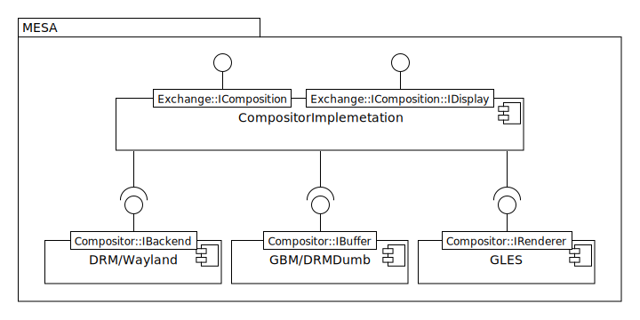
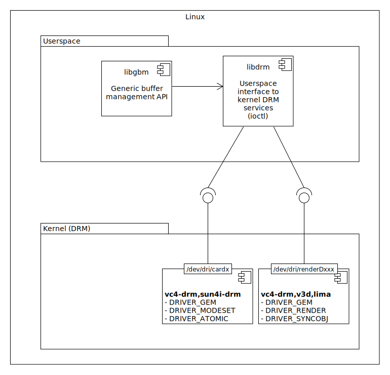

## Overview



### Backend
The backend is responsible for bliting the composition to a connector. It holds the framebuffers and controls the GPU. It depends on the ```DRIVER_MODESET``` or ```DRIVER_ATOMIC``` capabilities of the driver there for is should open a cardx node.

### Allocator
Used to allocate buffers in the GPU, this uses the ```DRIVER_GEM``` so it will work both cardx and renderDxxx nodes. 

### Renderer
As the name suggests the renderer will to render Textures to Buffers. This buffers can be any thing that is allocated using IBuffer. the opened node should  have ```DRIVER_RENDER```. 

## DRM



## Reads
- [Linux low level graphics part 1](https://www.collabora.com/news-and-blog/blog/2018/03/20/a-new-era-for-linux-low-level-graphics-part-1)
- [Linux low level graphics part 2](https://www.collabora.com/news-and-blog/blog/2018/03/23/a-new-era-for-linux-low-level-graphics-part-2)
- [DRM modifiers and hardware](https://www.linux.com/training-tutorials/optimizing-graphics-memory-bandwidth-compression-and-tiling-notes-drm-format-modifiers)
- [How to use hardware planes and all its quirks]( https://emersion.fr/blog/2019/xdc2019-wrap-up/#libliftoff)

## Resources
- [DRM DB](https://drmdb.emersion.fr)